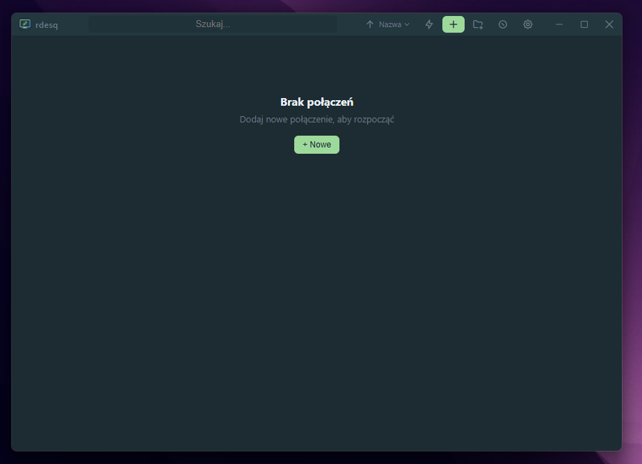
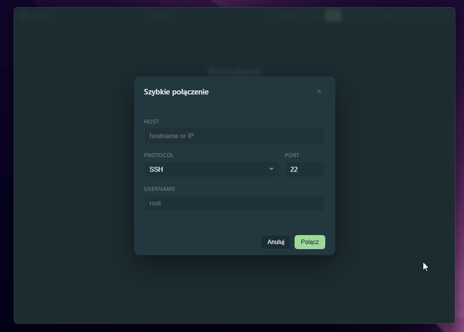
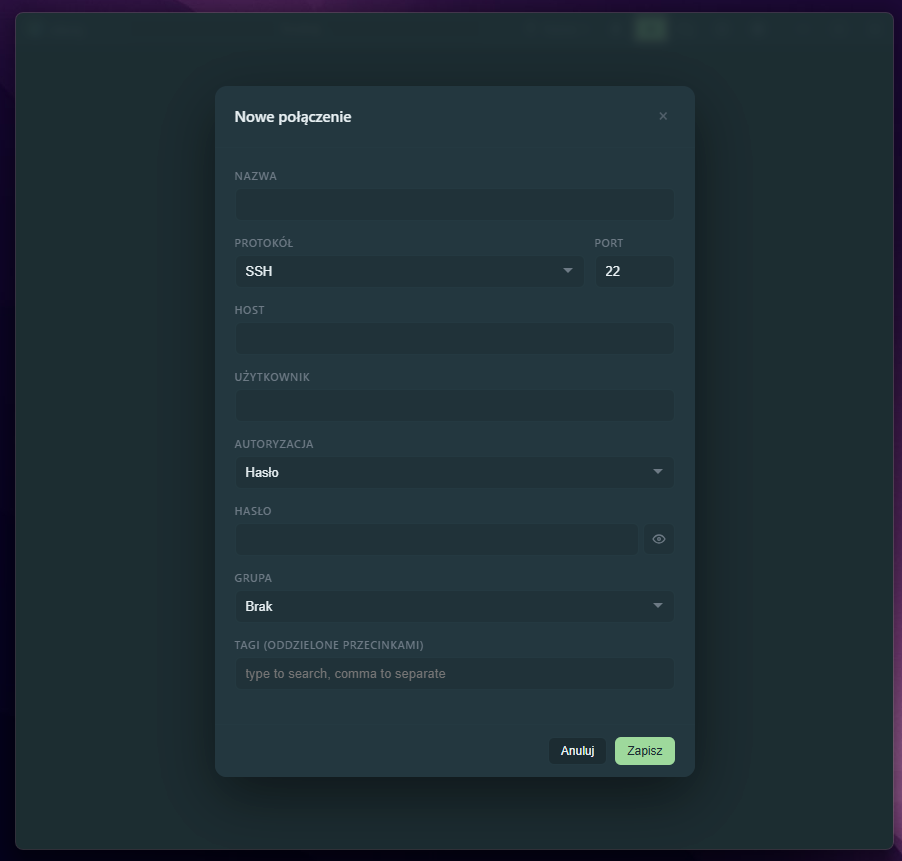
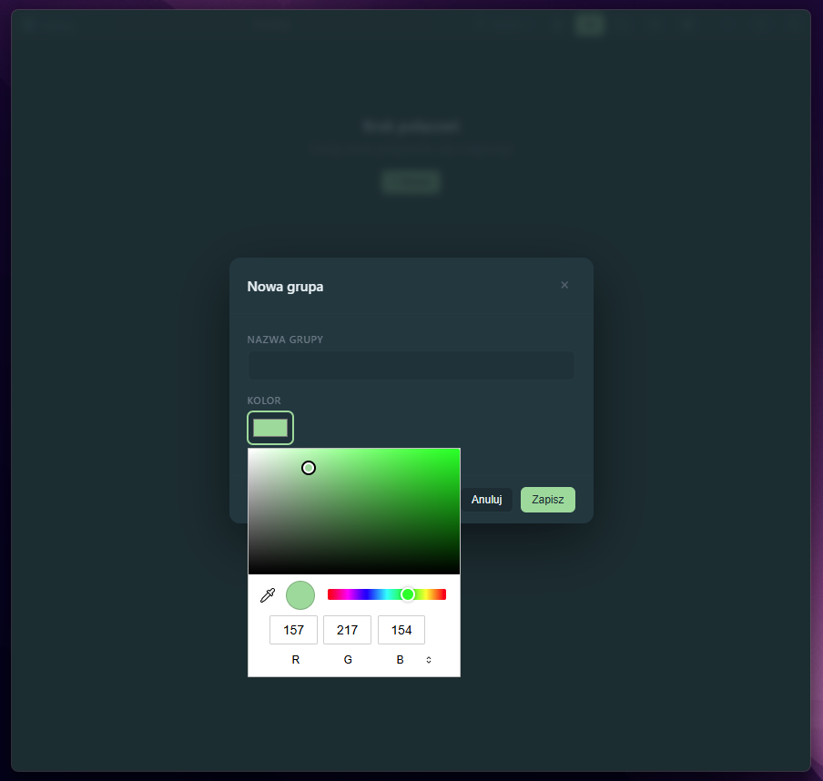
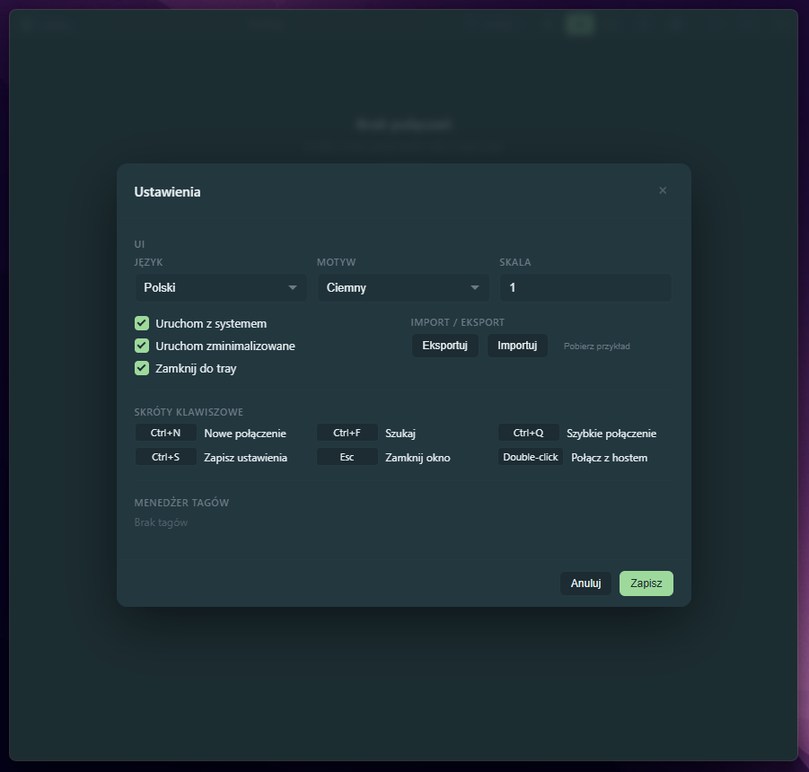
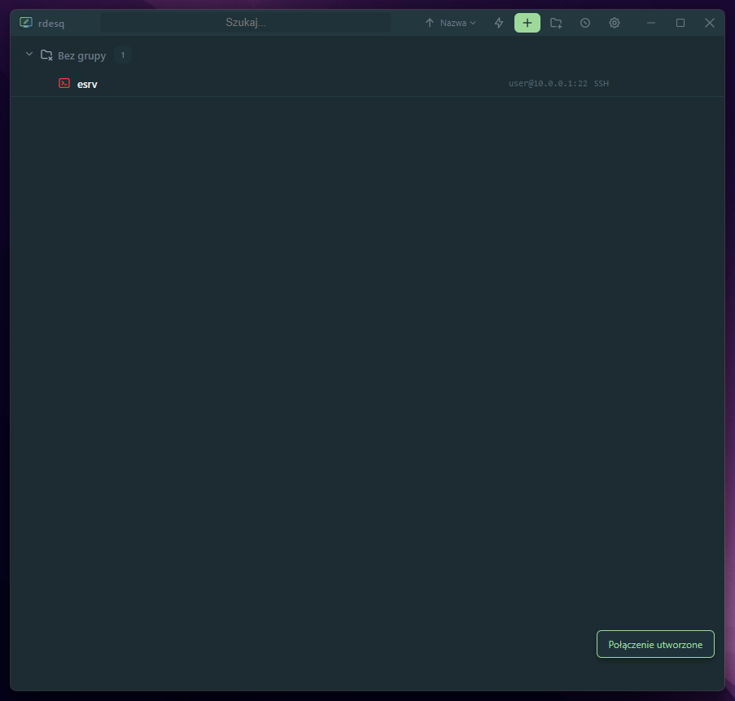
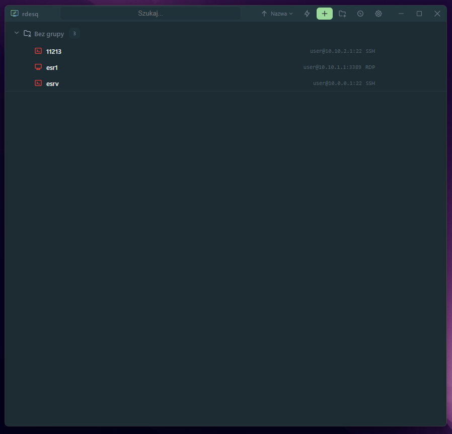
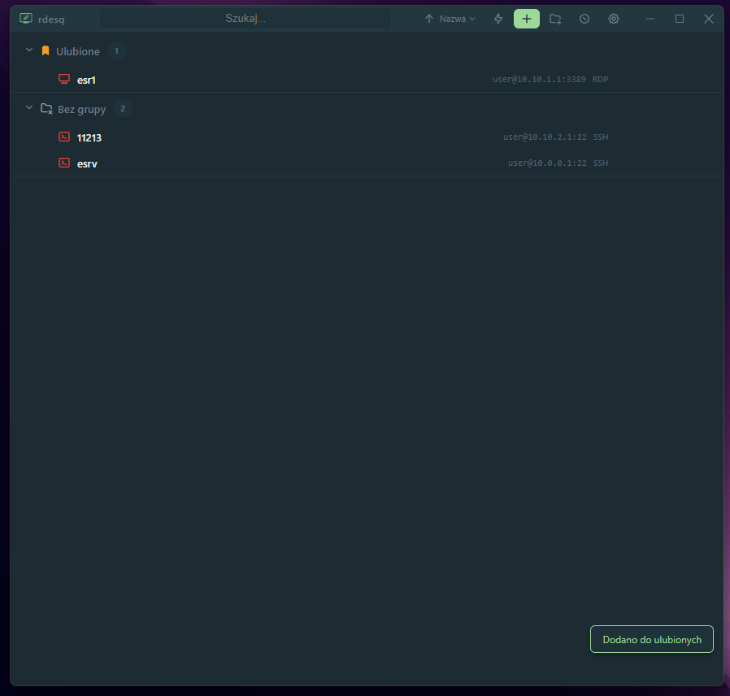
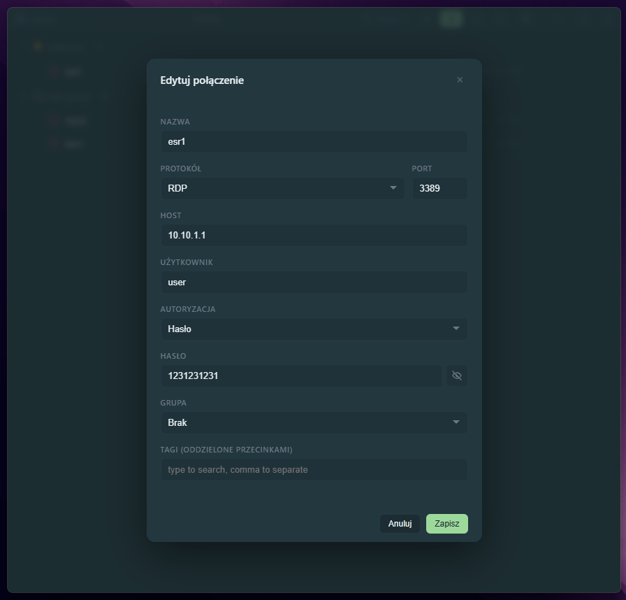
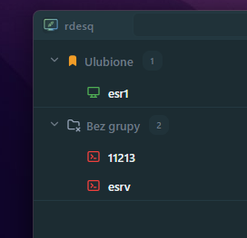

<picture>
  <source media="(prefers-color-scheme: dark)" srcset="icon.svg">
  
</picture>

# rdesq

**Remote Desktop Connection Manager** — a fast, cross-platform desktop app for organizing and launching SSH and RDP connections from a single unified interface.

<p>
  <a href="https://github.com/eincherjar/rdesq/releases/latest"></a>
  <a href="LICENSE"></a>
  <a href="https://github.com/eincherjar/rdesq/releases/latest"></a>
  
  
</p>

---

## Features

| Category | Details |
|----------|---------|
| **Protocols** | SSH (system terminal) and RDP (xfreerdp / mstsc) with password or private key auth |
| **Organization** | Color-coded groups with drag-and-drop reordering, tags with global manager, favorites |
| **Monitoring** | Async TCP ping with live online (green) / offline (red) indicators |
| **Search & Sort** | Real-time filtering by name, host, or tags; sort by name, host, or protocol |
| **Security** | Passwords encrypted at rest with AES-256-GCM |
| **Import / Export** | Full JSON backup and restore with smart deduplication |
| **Appearance** | Dark & Light themes, adjustable UI scale (0.25x–3x), bilingual EN/PL |
| **Convenience** | Quick Connect (Ctrl+Q), system tray with language-aware menu, autostart, start minimized, window state persistence |
| **Password-free SSH** | Quick-connect modal for password-free hosts; for password-protected SSH connections, launch via `sshpass` in your default system terminal (Kitty, Konsole, GNOME Terminal, Windows Terminal, etc.) |

---

## Screenshots












---

## Install

Download the latest release:

<p>
  <a href="https://github.com/eincherjar/rdesq/releases/latest">
    
    
    
    
  </a>
</p>

### Linux

```bash
# Debian / Ubuntu
sudo dpkg -i rdesq_*_amd64.deb

# Fedora / openSUSE
sudo rpm -i rdesq-*.x86_64.rpm

# AppImage (any distro)
chmod +x rdesq-*.AppImage
./rdesq-*.AppImage
```

**Dependencies** (deb): `libwebkit2gtk-4.1-0`, `libappindicator3-1`, `librsvg2-2`, `sshpass`

### Windows

Run the downloaded `.exe` installer — per-user install, no admin rights required.

---

## Build from source

### Prerequisites

- [Rust](https://rustup.rs) (stable)
- [Node.js](https://nodejs.org) 18+
- Linux system dependencies:

```bash
sudo apt install libwebkit2gtk-4.1-dev libappindicator3-dev \
  librsvg2-dev patchelf libgtk-3-dev libsoup-3.0-dev \
  libjavascriptcoregtk-4.1-dev
```

### Build

```bash
npm ci
npm run build
```

Artifacts are written to `src-tauri/target/release/bundle/`.

---

## Usage

### Keyboard Shortcuts

| Key | Action |
|-----|--------|
| `Ctrl+N` | New connection |
| `Ctrl+F` | Focus search |
| `Ctrl+Q` | Quick Connect modal |
| `Ctrl+S` | Save settings |
| `Esc` | Close active modal |
| Double-click | Launch a connection |

### Adding a Connection

1. Press **Ctrl+N** or click the **+** button in the title bar.
2. Fill in the connection details (name, host, port, protocol, credentials).
3. Optionally assign a group and tags.
4. Save — the connection appears in the list.

### Connecting

- **Double-click** any connection row to launch it.
- SSH connections open in your **system default terminal**.
- RDP connections launch via `xfreerdp` (Linux) or `mstsc` (Windows).

### Managing Groups

Drag connections between groups, collapse/expand sections, or create color-coded groups from the **+ folder** button.

### Quick Connect

Press **Ctrl+Q** to open the Quick Connect modal — enter a host and connect instantly without saving a permanent entry.

---

## Architecture

```
┌─────────────────────────────────────────────────┐
│                   Frontend                      │
│      Vanilla HTML / CSS / JS (no framework)     │
│         Data i18n, themes, toasts               │
└──────────────────────┬──────────────────────────┘
                       │ Tauri IPC (invoke)
┌──────────────────────┴──────────────────────────┐
│                Rust Backend                      │
│  commands.rs  │  db.rs  │  crypto.rs  │  ping.rs│
│  models.rs    │  (SQLite via rusqlite)           │
└──────────────────────┬──────────────────────────┘
                       │
┌──────────────────────┴──────────────────────────┐
│          System integration                      │
│  ssh / xfreerdp / Terminal.app / wt.exe         │
└─────────────────────────────────────────────────┘
```

### Tech Stack

| Layer | Technology |
|-------|-----------|
| Desktop framework | [Tauri 2](https://v2.tauri.app) |
| Backend | Rust — `rusqlite`, `aes-gcm`, `tokio`, `serde`, `uuid` |
| Frontend | Vanilla HTML / CSS / JS (no framework, no bundler) |
| Database | SQLite (WAL mode, foreign keys) |
| Encryption | AES-256-GCM |
| CI/CD | GitHub Actions — builds `.deb`, `.rpm`, `.AppImage`, `.exe` |

---

## Why rdesq?

- **Lightweight** — no Electron, no Java, no 300 MB installs. Built with Tauri 2 and vanilla JS.
- **Native** — SSH opens in your own terminal (Kitty, Konsole, Windows Terminal — whatever you already use).
- **Private** — all data stays in a local SQLite database; no accounts, no cloud, no telemetry.
- **Portable** — available for Linux (deb / rpm / AppImage) and Windows (exe).
- **Free & Open Source** — MIT license.

---

## License

[MIT](LICENSE)
